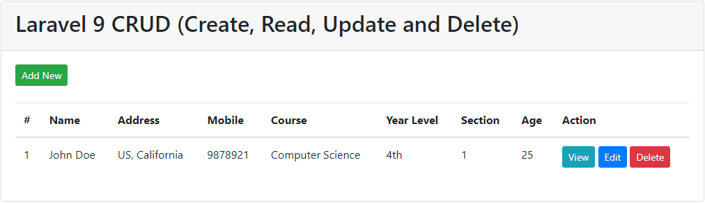

## Table of Contents

- [Prerequisites](#prerequisites)
- [Installation](#installation)
- [Running the Application](#running-the-application)
- [Contributing](#contributing)

## README

This repository contains code written in Laravel. Below are instructions on how to set up and run the Laravel project.

## Prerequisites

<ul>
    <li>PHP (recommended version: 7.4 or higher)</li>
    <li>Composer</li>
    <li>MySQL or any other compatible database server</li>
    <li>Node.js and npm (for frontend assets compilation, optional)</li>
</ul>

## Installation

<ol>
    <li>Clone this repository to your local machine:</li>
    <code>git clone https://github.com/your-username/your-repository.git</code>
    <li>Navigate to the project directory:</li>
    <code>cd your-repository</code>
    <code>composer install</code>
    <code>cp .env.example .env</code>
    <code>php artisan key:generate</code>
    <code>php artisan migrate</code>
</ol>

## Running the Application

To run the Laravel application locally, execute the following command:

<code>php artisan serve</code>

This will start a development server. You can access the application in your web browser at <code>http://localhost:8000</code>.

## Additional Notes

<ul>
    <li>Make sure your web server (e.g., Apache, Nginx) is properly configured to serve the Laravel application if you're not using the built-in development server.</li>
    <li>Ensure that appropriate file permissions are set, especially for storage and bootstrap/cache directories.</li>
    <li>For advanced usage and deployment considerations, please refer to the official <a href="https://laravel.com/docs">Laravel documentation</a>.</li>
</ul>

## Contributing

If you wish to contribute to this project, please fork the repository, make your changes, and submit a pull request.

## License

This project is licensed under the <a href="LICENSE">MIT License</a>.

